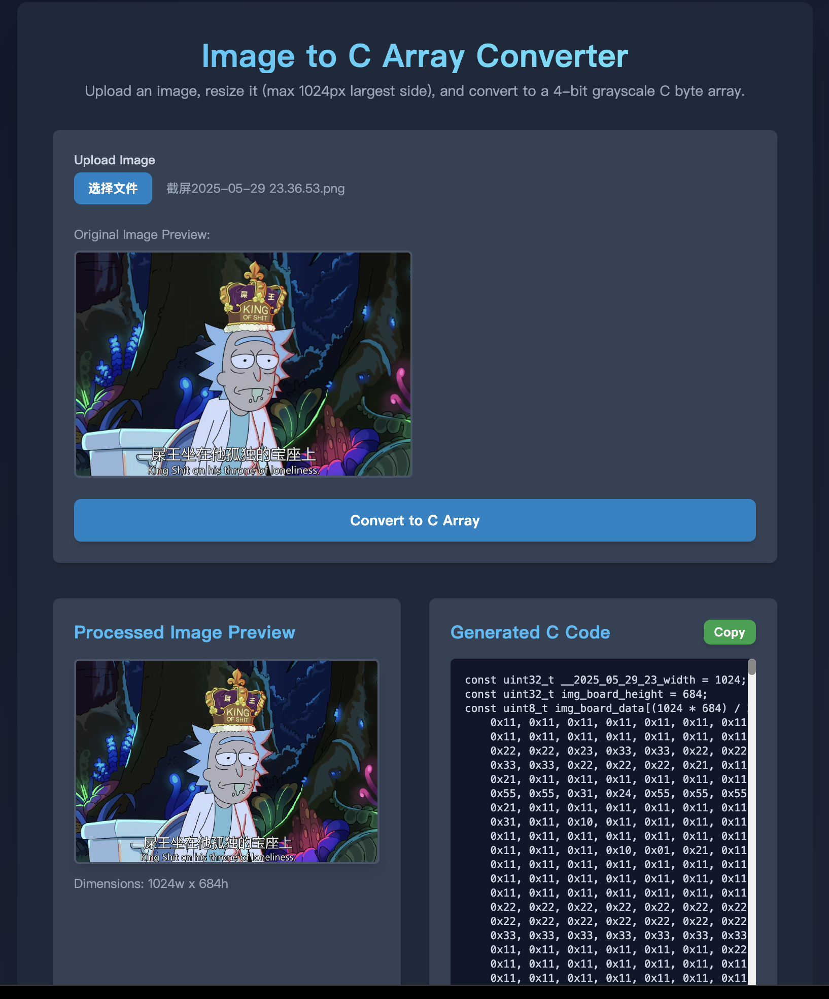

# Run and deploy your AI Studio app

This contains everything you need to run your app locally.

## Run Locally

**Prerequisites:**  Node.js

1. Install dependencies:
   `npm install`
2. Run the app:
   `npm run dev`

## show

